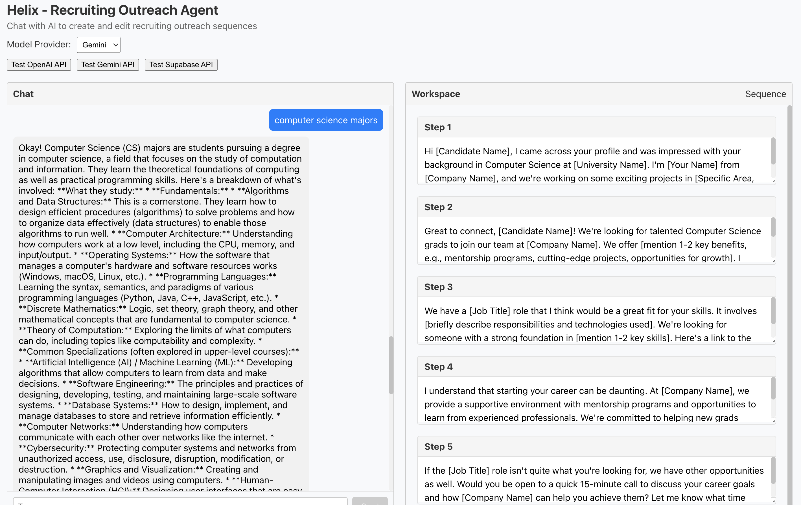

# Helix - Recruiting Outreach Agent

Helix is a fictional prototype of the SellScale HR Agent that includes a chat-driven interface for collecting user input and a dynamic workspace for displaying and editing recruiting outreach sequences.

## Project Structure

- `frontend/`: React-based frontend application with TypeScript
- `backend/`: Flask backend with endpoints for processing chat inputs and generating sequences
- Supabase is used as the relational database

## Features

1. **Chat Bar (Left Side)**: A conversational interface where users can input ideas and preferences about their recruiting outreach. The AI guides users with prompts and collects information.

2. **Dynamic Workspace (Right Side)**: A live document editor where the AI populates a outreach sequence based on user input. Users can directly edit the content, and the AI will respond to edits dynamically.

3. **Live Updates**: The AI dynamically updates the recruiting sequence in real-time as the user interacts with the chat or the workspace.




## Getting Started

### Prerequisites

- Node.js and npm
- Python 3.8+
- Supabase account

### Installation

1. Clone the repository
2. Set up the frontend:
   ```
   cd frontend
   npm install
   npm start
   ```
3. Set up the backend:
   ```
   cd backend
   pip install -r requirements.txt
   flask run
   ```
4. Configure Supabase connection in the backend

## Technologies Used

- Frontend: React, TypeScript
- Backend: Python Flask
- Database: Supabase (PostgreSQL)
- AI: OpenAI & Gemini API
